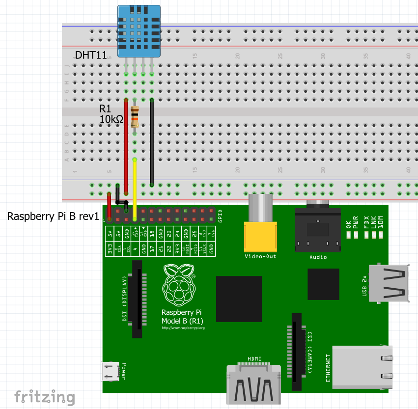

# iotsoftbox liveobject sample minimal

Here is the table of content:

- [Aim of the example](#aim-of-the-example)
- [Enable the example](#enable-the-example)
- [Sensor](#sensor)
	- [Wiring](#wiring)
- [Third party lib](#third-party-lib)
	- [Installation](#installation)
	- [Usage](#usage)

## Aim of the example

This example represents the minimal amount of code necessary to upload data to the LiveObject platform. It doesn't use simulated data but ones from a [sensor](#sensor). In this document you will find how to enable the compilation of the example and how to install a specific library to use the GPIO of the Raspberry Pi.

The compilation process is no different from the other one because everything is automated by cmake.

## Enable the example

**If you didn't installed the [library](#installation), it will fail at compilation time**

Go inside the top level cmake and uncomment the following line :

```cmake
#add_subdirectory(liveobjects_sample_minimal)
```

## Sensor

The [DHT11](https://www.adafruit.com/product/386) is a basic, ultra low-cost digital temperature and humidity sensor. It uses a capacitive humidity sensor and a thermistor to measure the surrounding air, and spits out a digital signal on the data pin (no analog input pins needed). Its fairly simple to use, but requires careful timing to grab data.
Description from Adafuit.com.

### Wiring


Source: http://www.uugear.com/wordpress/wp-content/uploads/2013/11/RPI-GPIO.jpg



## Third party lib

[WiringPi](http://wiringpi.com/) is a GPIO access library written in C for the BCM2835 used in the Raspberry Pi. It’s released under the GNU LGPLv3 license and is usable from C and C++ and many other languages with suitable wrappers (See below) It’s designed to be familiar to people who have used the Arduino “wiring” system.

### Installation

You must install WiringPi on your Pi and then resynchronise the Sysroot on Windows.

```bash
git clone https://github.com/WiringPi/WiringPi.git
cd WiringPi
./build
```

Or on Linux run the script wiringPiInstaller.sh
It will install everything you need to compile the example with the ARM compiler.
You may have to tune it to change the compiler or the target.

### Usage

A basic example is available [here](https://github.com/WiringPi/WiringPi/blob/master/examples/blink.c).

Don't forget to link the library :

```cmake
target_link_libraries(${EXECUTABLE_NAME}
 wiringPi
 ...)
```

**All programs using Wiring Pi must be run with sudo**
