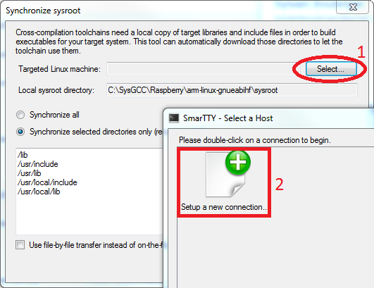
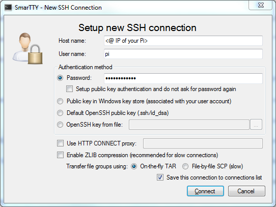
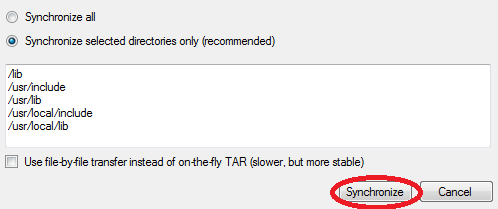
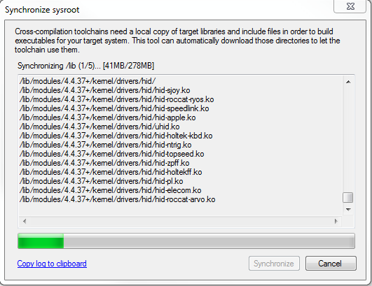
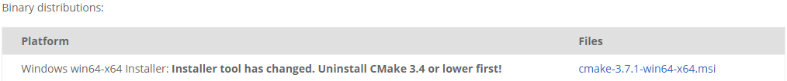
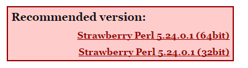

# Detailed Windows Setup

- [Compiler](#compiler)
	- [Download](#download)
	- [Install](#install)
- [Sysroot](#sysroot)
- [CMake](#cmake)
	- [Download](#download)
	- [Install](#install)
- [Perl](#perl)
	- [Download](#download)
	- [Install](#install)

## Compiler

### Download

Go [there](http://gnutoolchains.com/raspberry/) to download the crosscompiler for a Raspberry Pi running on Debian Jessie.


### Install

Accept the the term of the license agreement and select install. You can change the directory but this will impact the cmakeWinSetup.bat script so you will have to adapt it.

## Sysroot

A sysroot is a folder which contains a minimal filesystem (especially libraries, the C library and header files). An example sysroot could look like this: 'sysroot/usr', 'sysroot/usr/lib', 'sysroot/usr/include'.

To get the Pi one use the following instructions :

Launch ```C:\SysGCC\Raspberry\TOOLS\UpdateSysroot.bat```, it has been installed with the compiler.












Once done you can go to the next step.

## CMake

### Download

Go [here](https://cmake.org/download/) and download :



### Install

Nothing special here, just follow the instructions. Also remember where you're installing it, the path is needed inside the cmakeWinSetup.bat script.

## Perl

### Download

Go [there](http://strawberryperl.com/) and download the recommended version :



### Install

Nothing special here, just follow the instructions. Also remember where you're installing it, the path is needed inside the cmakeWinSetup.bat script.
